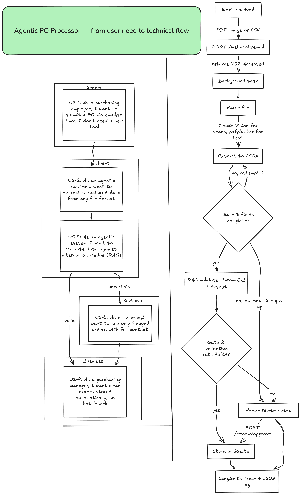

# Agentic PO Processor

Agentic AI pipeline for purchase order processing — extraction, RAG validation, and human-in-the-loop review.

Built as a technical test task for the **Agentic AI Engineer** position at Flat Rock Technology.

---

## Overview

A company receiving purchase orders by email — as a PDF, a photo of a signed document, or a CSV export — normally has someone open each one, type the details into a system, sanity-check the supplier and price, and decide whether to approve it.

This agent handles that first pass. It picks up the email, reads the attachment regardless of format, pulls out supplier/items/quantities/prices, and checks that against what the company already has on file — approved suppliers, expected price ranges. Orders that check out get saved. Orders with a missing field, an unrecognized supplier, or a price outside the normal range get set aside for a person to look at, with the reason attached.

**For a product manager:** this is a triage layer, not a replacement for judgment. It's meant to remove the routine orders from a reviewer's queue so their time goes to the ones that actually need a decision.

**For a reviewer:** you'll only see orders the system couldn't confidently process, and you'll see why — a missing field and a validation mismatch are flagged separately, so you know what you're checking before you open it.

**For an engineer picking this up later:** each design decision below comes with the trade-off it made, not just what was built but why it was built this way instead of the obvious alternative.

---

## Why this scenario (Purchase Orders)

The task explicitly ruled out invoices — "every automation platform has a ready-made template for that." Purchase orders were chosen instead because they hit every requirement in a way that's genuinely demonstrable, not decorative:

- They have a natural structure (supplier, items, quantities, prices), so extraction has a clear target.
- They have a natural source of truth to validate against (a list of approved suppliers, expected price ranges) — so RAG has real work to do, not just a lookup to fake.
- They have natural ambiguity (a missing field, a price out of range, an unrecognized supplier) — so the human-review path isn't hypothetical, it's something the system will actually hit.

---

## System design — problem by problem

### Problem 1: The sender shouldn't have to wait for processing to finish

An email attachment might need OCR/vision processing and multiple LLM calls — that can take 10–30 seconds. If the webhook holds the connection open that whole time, it looks broken from the sender's side, and it doesn't scale if orders arrive in bursts.

**Solution:** The webhook (`POST /webhook/email`) responds immediately with `202 Accepted`, then hands the actual work to a background task. The sender gets instant confirmation; the real processing happens independently.

The trade-off: FastAPI's `BackgroundTasks` loses in-flight work if the server restarts mid-run. Fine for a 72-hour demo. In production this would move to a durable queue — Redis + RQ or Celery.

### Problem 2: A file could be a clean PDF, a scanned image, or a spreadsheet — and each needs different handling

**Solution:**
- **Text-based PDF** → `pdfplumber` extracts text directly. Fast, cheap, no LLM call needed.
- **Scanned PDF or image** → Claude Vision reads it directly instead of running OCR (Tesseract) first. Tesseract is free but chokes on poor scans, unusual fonts, or noisy photos, and it's another tool to install and babysit. Vision costs more per call but is far more reliable, and the same model ends up handling both vision and text — one less moving part in the pipeline.
- **CSV** → loaded with `pandas`. If the column headers match an expected set exactly (`supplier_name`, `product_code`, `quantity`, `unit_price`), it converts to JSON directly in code, no LLM involved. Anything else falls back to the same Claude extraction path as PDF/image. Clean CSVs stay cheap and predictable; only the messy ones cost an LLM call.

### Problem 3: An LLM extraction can be incomplete, and validating incomplete data is worse than useless

Run RAG validation against a half-filled record and you can get a confident-sounding answer about data that isn't even real.

**Gate 1 — Extraction Completeness:** after extraction, the agent checks what fraction of required fields (`supplier.name`, `items[].product_code`, `items[].quantity`, `items[].unit_price`) actually got filled in.

- Below `0.6` → retry extraction once with an adjusted prompt.
- Still below `0.6` after that → stop, route to human review.

The retry cap exists because an unreadable file could otherwise send the agent into an open-ended loop, burning time and API cost for no gain. One retry is enough to catch a bad first pass without leaving the failure mode unbounded.

### Problem 4: Extracted data can be *complete* but still *wrong*

A supplier name or product code can be sitting right there in the extracted JSON and still be wrong — nonexistent, or outside agreed terms.

**RAG validation:** a small knowledge base (approved suppliers, item catalog with price ranges, a few sample policies) sits in ChromaDB, indexed with Voyage AI embeddings — Voyage over the more common OpenAI default because it's purpose-built for retrieval and it's what Anthropic recommends pairing with Claude.

Retrieval by itself doesn't count as validation here. The closest-matching supplier name in the database might just be *textually* close — a near-match on the name could easily be a different company. So there's a second step: the extracted data and the retrieved document both go to the LLM with one question — does this actually match, or is there a discrepancy? That reasoning call, not the similarity score, is what decides valid or invalid per item.

**Gate 2 — RAG Validation Rate:** once every item has a verdict, the system works out what percentage passed.

- `≥ 75%` → order accepted, stored.
- `< 75%` → the entire order goes to human review, not just the failing line.

Splitting an order — auto-approving the good lines, flagging only the bad one — is possible, but it means partial-order state, partial storage, partial notifications, more than a 72-hour scope should take on. Flagging the whole order is the simpler call, and it's simpler on purpose, not because splitting wasn't considered.

### Problem 5: Someone needs to be able to act on a flagged order without a custom UI

Flagged orders go into a `pending_reviews` table with the full context of why they were flagged. `POST /review/approve`, protected with an `X-API-Key` header, lets a reviewer approve an order by ID and moves it into `purchase_orders`. There's no UI — a callable, authenticated endpoint is enough to prove the review loop actually closes, which is the part that matters for this task.

### Problem 6: When something goes wrong, someone needs to be able to find out why

Every LLM call, RAG lookup, and routing decision is traced through LangSmith (`LANGCHAIN_TRACING_V2=true`), plus structured JSON logs carrying a `correlation_id` that ties one order's journey together end to end. It's a small addition, and it's the reason a bad outcome is traceable instead of a mystery.

---

## Two confidence gates, kept separate on purpose

One overall "confidence score" would be simpler to log and simpler to explain in a sentence. It would also hide two different failure modes behind one number:

| Gate | Question it answers | When it runs | Response if it fails |
|---|---|---|---|
| **Gate 1** — Extraction Completeness | Did we get all the required fields? | Right after extraction, before RAG | Retry once, then route to review |
| **Gate 2** — RAG Validation Rate | Is what we got actually correct? | After RAG validation | Route to review, no retry |

A missing field and a bad price are different problems that need different fixes — collapsing them into one score would mean a reviewer opens a flagged order with no idea which kind of problem they're looking at.

---

## Left out, on purpose

- **Real email integration (IMAP/SendGrid):** the task allows "a webhook or trigger" — a live inbox integration adds complexity without adding to what's actually being evaluated here.
- **Idempotency:** the same email arriving twice (a provider retry, say) would currently get processed twice. Production fix: dedupe by file hash combined with sender and subject.
- **Multi-page PDF cost:** every scanned page currently goes through Vision. Production would extract text where possible and fall back to Vision only for scanned pages, to cut cost and latency.
- **Durable task queue:** `BackgroundTasks` doesn't survive a server restart. Production would move to Redis-backed queueing.
- **Auth on `/review/approve`:** the `X-API-Key` check is real but minimal — enough to show the endpoint isn't wide open, not a full auth system.

These are scope calls, not things that got missed.

---

## User stories

| ID | As a... | I want... | So that... |
|---|---|---|---|
| US-1 | Purchasing employee | to submit a PO by sending an email | I don't need to learn a new tool |
| US-2 | Agentic system | to extract structured data from any supported file format | downstream steps can work with consistent data |
| US-3 | Agentic system | to validate extracted data against internal knowledge | invalid or suspicious orders are caught early |
| US-4 | Purchasing manager | clean orders to be stored automatically | my team isn't bottlenecked reviewing routine orders |
| US-5 | Approvals reviewer | to see only the orders the system is uncertain about, with context | I can focus on genuine edge cases |

---

## Tech stack

| Component | Choice | Reasoning |
|---|---|---|
| LLM | Claude Sonnet 3.5 | Also handles vision, reducing the stack's moving parts |
| Embeddings | Voyage AI | Purpose-built for retrieval; Anthropic-recommended |
| Agent framework | LangGraph | Native support for stateful, conditional, cyclic flows (needed for the retry loop) |
| Vector DB | ChromaDB | Lightweight, no external server needed for this scope |
| Storage | SQLite | No external dependency, still demonstrates relational data handling |
| API | FastAPI | Async-native, easy background task support |

---

## Architecture



*From user need (left) to technical flow (right) — email intake through validation gates to storage and human review.*

---

## Setup

```bash
pip install -r requirements.txt
cp .env.example .env  # add your API keys
uvicorn main:app --reload
```

## Testing

```bash
pytest tests/
```

Unit tests cover the deterministic logic (Gate 1/Gate 2 thresholds, CSV header matching). The end-to-end path is demonstrated with three sample files (`data/demo_files/`) covering a valid order, one with a missing field, and one with a conflicting price — see the screen recording for a live walkthrough.
